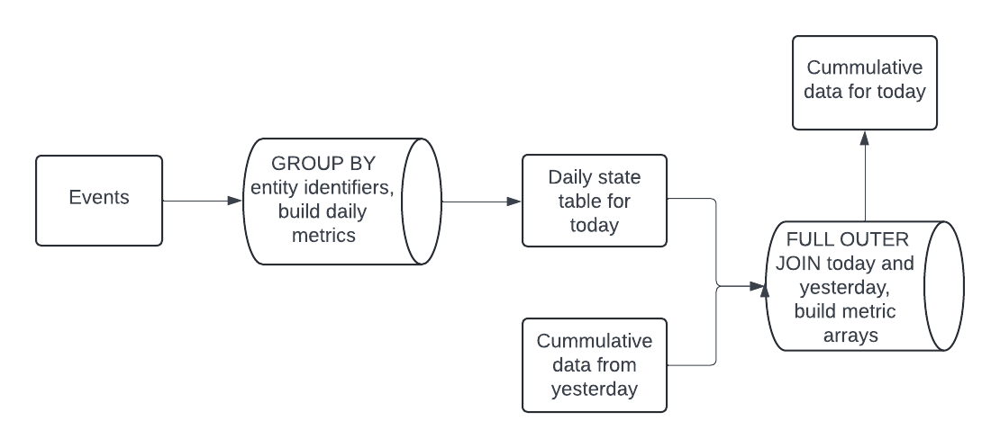

# Cummulative Table Design

Cumulative table design is a really useful tool for data engineers. It helps them analyze data over long periods, even thousands of days, without any problems. Here's a simple diagram showing how it works-



First, we start by creating a table that holds daily metrics. This table is based on the specific thing we're interested in tracking. We gather this data from the various event sources upstream.

Once we have our daily metrics, we combine yesterday's cumulative table with today's fresh data using a FULL OUTER JOIN operation. Then, we organize our metrics into arrays for each user. This approach helps us incorporate new data into our historical records without having to go through all of it again, which significantly improves performance.

We can use functions like `UNNEST` and `SUM` to compute any metric we need, covering whatever time frame the array represents.
```
The longer your analysis period, the more important this pattern becomes!
```

## Example User activity and engagement cumulated

All query syntax is using **PostgreSQL** syntax and functions
```
We'll be using the dates:

2024-04-13 as today
2024-04-14 as yesterday
```

In this example, we'll explore how to set up this design to calculate the number of users active on a daily, weekly, and monthly basis, as well as tracking metrics like user likes, comments, and shares.


Our source table in this case is [events](tables/events.sql).

- A user is active on any given day if they generate an event for that day.
- The table has event_type which is like, comment, share, or view.

This design is pretty simple with only 2 steps:

### Daily table aggregation
- We aggregate the events of today to see who is daily active. The table schema is [here](tables/active_users_daily.sql).
- This query is pretty simple and straight forward [here](queries/active_users_daily_populate.sql).
    - `GROUP BY user_id` and then count them as daily active if they perform any events
    - we add a few `COUNT(CASE WHEN event_type = 'like' THEN 1 END)` statements to figure out the number of daily likes, comments, and shares as well

### Cummulative table
- Table schema for this step is [here](tables/active_users_cummulated.sql).
- Query step is broken down into sub-steps. Its [here](queries/active_users_cummulated_populate.sql).
    - This step we take today's data from the daily table and yesterday's data from the cumulated table.
    - We `FULL OUTER JOIN` these two data sets on `today.user_id = yesterday.user_id`.
    - If a user is a new user, they won't be included in yesterday's data. Similarly, if a user didn't engage today, they won't be in today's data either.
    - So we need to `COALESCE(today.user_id, yesterday.user_id)` as user_id to keep track of all the users.
    - Next, we aim to construct the `activity_array` column. However, we need the `activity_array` to only retain data from the past 30 days-
        - To determine whether to add today's value to the beginning of the `activity_array` or if we need to remove an element from the end to maintain a 30-day window, we check if the number of elements in the `activity_array` using `CARDINALITY(activity_array) < 30`
        - We need to perform `COALESCE(t.is_active_today, 0)` to put zero values into the array when a user isn't active.
    - We follow a very similar pattern to how we built activity_array but for likes, comments, and shares as well.
    - After we build all our metric arrays, calculating weekly and monthly activity is pretty straight forward-
        - `CASE WHEN (SELECT SUM(s) FROM UNNEST(activity_array) s) > 0 THEN 1 ELSE 0 END` gives us monthly actives since we limit the array size to 30
        - `CASE WHEN (SELECT SUM(s) FROM UNNEST(activity_array[1:7])) > 0 THEN 1 ELSE 0 END` gives us weekly active since we only check the first 7 elements of the array (i.e. the last 7 days)
    - Aggregating the number of likes, comments, and shares in the past 7 days is also easy-
        - `(SELECT SUM(s) FROM UNNEST(like_array[1:7]) s)` num_likes_7d gives us the number of likes this user did in the past 7 days.
        - `(SELECT SUM(s) FROM UNNEST(like_array) s)` gives us the number of likes this user did in the past 30 days since the array is fixed to that size.

